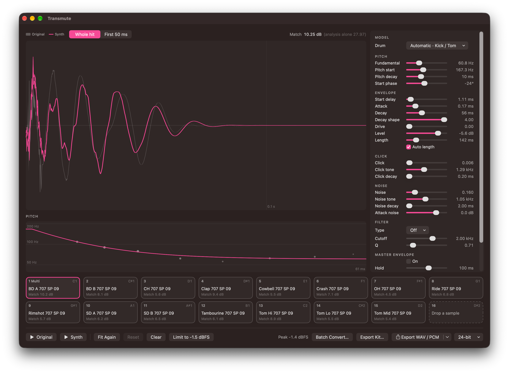
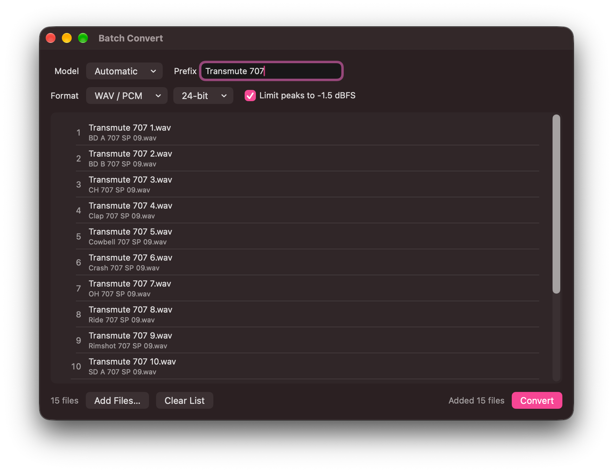

# Transmute

A recorded drum hit in, a synthesised one out, for macOS. Drop a kick, a
tom, a snare, a hi-hat, a cowbell, clave, rim, woodblock or a clap - a vinyl sample, a hit from an old break, a one-shot you like but
cannot use as it is - and Transmute measures what makes it sound the way it
does: the pitch it starts at, how fast it falls, where it settles, how it
decays, its click and its noise. Then it rebuilds the hit from a small synth
voice. The result is clean (no crackle, no hiss, no bleed), every part of it
is a slider, and it exports as a WAV at the rate the sample came in.

Sixteen pads, in two rows of eight, make it an instrument: each holds its own drum, with a filter,
a master envelope and pan, and plays by click or from a MIDI controller
(an Akai MPD218's bank A by default), notes and knobs learnt by
right-click. A `.drumkit` file keeps all sixteen. Five models: **Kick /
Tom**, **Snare**, **Hi-Hat**, **Modal** and **Clap**, suggested by the
analysis or chosen per pad - before a sample is dropped, too.

Native Swift. No SuperCollider, no Python, nothing to install: decoding and
export are Core Audio, the analysis is Accelerate/vDSP, the synth is a plain
Swift function, and AVAudioEngine plays it.



```
No SignUp
No User Profiling
No Tracking
No Cookie Banners
No Terms & Conditions
No Paywalls
No Ads
No Data Mining
```

Transmute is an offline application. It has no network code, contacts no
server and collects no analytics; it is sandboxed and built without the
network entitlement. Its only entitlements are the sandbox itself and
read-write access to the files you pick.

## Install

Download `Transmute-1.3.dmg` from
[Releases](https://github.com/TZorr/Transmute/releases), open it and drag
Transmute onto Applications. Apple Silicon, macOS 26.5 or later.

The app is not notarised (it is ad-hoc signed, as every local build is), so
the first launch is refused. Open it once, then System Settings › Privacy &
Security › *Open Anyway*. Or, in Terminal:

```bash
xattr -dr com.apple.quarantine /Applications/Transmute.app
```

Building it yourself works as well - see [Building](#building).

## Using it

1. **Drop a hit on a pad** at the bottom (or right-click › Load Sample…,
   ⌘O for the selected pad). Pad 1 is **1 Multi**: up to sixteen files
   dropped (or chosen) there, sorted by name as Finder sorts them, replace
   pads 1-16 without asking - fewer leave the other pads as they are, more
   than sixteen are left out. Every other pad takes one file (of several,
   the first by name). **Clear** at the bottom (Drum › Clear All Pads)
   empties all sixteen pads; their pan, notes and model choice stay.
   **Reset All** (Drum › Reset All…) goes back to Transmute as it opens -
   pads empty, pan, notes and models at their defaults, pad 1 selected,
   the batch list empty - after asking; Settings, the export boxes and
   learnt CCs stay, as over a restart.
   **Dragging a pad onto another swaps them**: drum, pan and model choice
   change places - a fit still running goes along - while the MIDI notes
   stay where they are, so pad 1 still answers to C1 (Kitbox's rule). The
   selection follows the dragged pad. Dragging a drum onto an empty pad
   moves it there. WAV, AIFF, CAF, FLAC, ALAC, AAC/M4A and MP3
   all work, up to 10 seconds. Stereo is folded to mono by averaging.
   Silence or noise before the hit is trimmed off.
2. **Analysis and fit start on their own.** The measured first guess is
   playable at once; the fit then refines it for a few seconds (progress on
   the pad). Fits run in parallel, as many as the Mac has cores less two
   (eight on a ten-core machine); the others show "Waiting to fit".
   Measured: eight modal samples ready in 9.7 s instead of about 17 one
   after another, up to six cores busy - the longest single fit (the 808
   cowbell's, 7.8 s) sets the floor. Inside a fit the grids run in
   parallel too - the drive trials, the click's and the bands' grids - and
   pick their winner in the old order, so every fit is bit for bit what it
   was - and so do the five parts of every comparison (four resolutions and
   the envelope). A modal drum's modes are rendered with vForce, whole
   arrays at a time. Single fits, measured: snare 7.1 s → 3.0, modal
   (808 cowbell) 7.8 → 4.7, hat 4.3 → 2.9, kick 2.1 → 1.5; the simplex
   searches between the grids stay sequential.
   Everything above the pads - waveform, pitch, parameters, Match, the
   buttons below - is the **selected** pad's; a click on a pad selects it,
   Tab and Shift-Tab step to the next and previous pad (16 wraps to 1).
3. **Compare.** The waveform shows the original (grey) under the synth
   (outline) - *Whole hit* or *First 50 ms*, where the attack and the click
   are. The pitch view shows every period the analysis measured as a dot,
   and the synth's sweep as a line through them. **Match** is the mean
   distance between the two in dB (spectrum, envelope and pitch together);
   lower is closer. It moves live while you drag a slider.
4. **Listen.** *Original* (⌘1) and *Synth* (⌘2) play the selected pad's
   hit from the top; Space plays the last one again. A click on a pad plays
   it through the kit, with its pan, and several pads sound at once.
5. **Adjust.** Every parameter is a slider. **Fit Again** (⌘R) fits from
   the parameters as they are now - nudge a slider towards where you hear
   the answer, and the fit takes it from there. **Reset** (⇧⌘R) returns to
   the last fit.
6. **Export** (⌘E): WAV, AIFF, CAF (16-bit · 24-bit · 32-bit float), FLAC
   and M4A/ALAC (16 · 24-bit), mono, at the source file's sample rate.
   Integer depths get TPDF dither. The bottom bar shows the synth's peak;
   above 0 dBFS it turns orange, because 16- and 24-bit files clip there
   (float keeps it) - lower *Level*.
   Lossless formats only, on purpose: AAC and MP3 put encoder delay in
   front of the hit, which many samplers play as silence.
7. **Save Parameters** (⌘S) writes the selected pad's `.drumparams` file
   (readable JSON). Opening one (⇧⌘O, or dropping it on a pad) works with or
   without a sample loaded - without one, the pad is a synth drum.
8. **Kits:** File › New Kit (⌘N), Open Kit… (⌥⌘O), Save Kit… (⌥⌘S). A
   `.drumkit` holds all sixteen pads - drum, filter, master envelope, pan,
   note - but no samples, so a pad from a kit has no original and no Match
   until a sample is dropped on it again.
9. **Export Kit** (⌥⌘E, or the button beside Export) writes every pad
   that holds a drum into one folder, each file under its pad's own name -
   the sample's (`BD Acoustic Round Indie 01.wav`) or the parameter
   file's; two pads with one name give `Kick.wav` and `Kick 2.wav`.
   **Rename** in the folder panel (remembered, off by default) names them
   `<prefix> <pad number>` instead - prefix *TR-707 Transmute* gives
   `TR-707 Transmute 1.wav` … `TR-707 Transmute 8.wav`; the first file
   name is shown as you type. Format and depth are the export boxes'. Each
   file is its pad as Export would write it: mono, at its sample's rate.
   Empty pads are skipped - renamed, the numbers stay the pads' - and
   files already there are replaced only after asking. `/` and `:` in a
   name become `-`.
   **Export Kitbox Kit…** (⇧⌥⌘E, or the arrow on Export Kit…) writes the
   kit as one `.aupreset` for [Kitbox](../../Kitbox), the 16-pad sampler:
   every drum as a sample on its own pad (named as above, in the export
   boxes' format and depth), with the pads' pan and notes; every other
   Kitbox knob at its default, Level 0 dB and Decay Full, so the file
   plays as rendered. The panel opens in Kitbox's kit folder
   (`/Library/Audio/Presets/Kitbox` if made, else Logic's Plug-In Settings
   folder for Kitbox), so Kitbox's Load Kit and Logic's settings menu find
   it.
10. **Max level.** Settings › Level holds a ceiling for peaks, typed or
    stepped in 0.5 dB (-12 to 0 dBFS, default -1.5). **Limit to -1.5 dBFS**
    at the bottom (Drum › Limit Peaks, ⌥⌘L) lowers *Level* on every pad
    whose peak is above it by exactly the overshoot - the synth's gain is
    its last multiply, so the peak moves dB for dB - and leaves the others
    alone; it never raises one. The peak is taken at both the window's rate
    and the export rate, whichever is higher. Pads still loading or fitting
    are limited as soon as their fit is done, so one click reaches all
    sixteen; Reset goes back to the unlimited fit.
    No message lists the pads it lowered - the Peak readout shows where
    the selected pad now is.
11. **Batch Convert** (File › Batch Convert…, ⇧⌘B, or the button left of
    Export Kit…) is a separate window:
    drop audio files or folders on it (subfolders included), or use Add
    Files…. The list is sorted by name and numbered; each file is decoded,
    analysed, fitted and written under its own name (`808 CLAP.wav`; the
    same name from two folders gets ` 2`), or with **Rename** on as
    `<prefix> <number>`. **Convert** asks
    for the folder - New Folder is in the panel, which opens where the
    last batch went. **Model** applies to every file:
    Automatic lets each sample's analysis choose, *Clap* analyses and fits
    all of them as claps. Format and depth are the export boxes'; **Limit
    peaks to …** (on by default) holds each file to the max level. The fits
    share the pads' queue - every core but two - and Stop cancels what is
    left; files written stay. The pads are not touched.

    

## Playing

- **Rename** a pad by right-click › Rename…: the name shows on the pad,
  is saved in the `.drumkit` and names the pad's file in exports and in a
  Kitbox kit. An empty name goes back to the sample's own; a new sample,
  a parameter file or Clear drops it, a model change keeps it.
- **Filter** per pad: Off, Low-Pass or High-Pass (24 dB/oct) or Band-Pass,
  with Cutoff and Q. It is part of the drum (exports include it); the fit
  leaves it where it is but fits the drum through it.
- **Pan** per pad, equal-power (centre −3 dB each side). Playback only:
  exports stay mono one-shots.
- **Master Envelope** per pad, after everything else, the filter
  included: On, then **Hold** (full level from the file's start),
  **Release** (down to exactly 0) and **Curve** (1 linear; higher falls
  fast and lingers, lower holds and then drops). For when one layer - a
  noise band, a modal partial, a clap's tail - rings on long after the
  rest: it ends them all at one point, and the exported file ends there
  (Length shows it). The fit takes it off while fitting and puts it back,
  so Fit Again does not stretch the decays to make up for it.
- The pads play at one level whatever the velocity: they are for hearing
  what will be exported. (Four velocity slots per pad existed until
  2026-09-26; kits that have them still open.)
- **MIDI**: choose the controller in Settings (⌘,). Pads answer to notes
  36-51 (C1-D#2, the MPD218's bank A, all sixteen pads); a kit saved
  with eight pads opens with 9-16 empty; right-click a pad › Learn Note to change
  one. Right-click any slider or Pan › Learn MIDI CC: the knob
  then moves that control on the selected pad, over the same travel as the
  slider. Learning takes a note or a CC away from whatever had it. Learnt
  CCs are kept per Mac and listed in Settings.

## The synth

Five models, chosen per pad under *Model* at the top of the parameters -
also on an empty pad, which then analyses whatever is dropped on it as
that drum (the choice stays with the pad and in the `.drumkit`, like its
pan). *Automatic* lets the analysis choose, by the strongest peak of the
first 100 ms and where the energy lies:
- **Clap** - four or more bursts above 1 kHz in a row, 6-16 ms apart and
  even to within 20 % (the 808, 909 and "smooth" claps: 9.8-13.3 ms; a
  ragged real clap like the Linn's does not pass and can be chosen),
- **Hi-Hat** - peak at 5 kHz or above and less than −12 dB of the first
  200 ms below 1 kHz (the hats measured: peaks 7-16 kHz, −24 to −55 dB),
- **Modal** - peak between 200 Hz and 5 kHz (cowbells, claves, rims, a
  woodblock: 215 Hz to 3 kHz; a tom tuned that high lands here too),
- **Snare** - more than −17.5 dB above 2 kHz (snares −3 to −15),
- **Kick / Tom** otherwise.

The menu marks the suggestion; on a loaded pad, choosing another model
analyses and fits the sample again. A `.drumparams` or `.drumkit` file from before the snare model opens
as Kick / Tom.

**Kick / Tom** - one voice, three layers:

| Layer | Parameters |
|---|---|
| **Body** - a sine whose pitch falls exponentially | Fundamental (where it settles), Pitch start, Pitch decay (time constant), Start phase |
| **Envelope** of the body | Attack, Decay (time constant), Decay shape (1 = exponential, above 1 it holds and then falls - an 808's boom), Drive (tanh saturation, body only), Level |
| **Click** - a high-passed noise burst, the beater | Click (peak relative to the body's), Click tone, Click decay |
| **Noise** - band-passed noise, shell and air | Noise (level relative to the body's peak), Noise tone, Noise decay |
| **Attack noise** - measured, not modelled | Attack noise (level); the table itself comes from the fit |

**Snare** - the same, with two changes:

| Layer | Parameters |
|---|---|
| **Mode 2** - the head's second mode, a sine at a ratio of the body's pitch, following its sweep | Mode 2 (peak relative to the body's), Mode 2 ratio, Mode 2 decay (time constant, usually far shorter than the body's) |
| **Noise (wires)** instead of the shell - noise between a 12 dB/oct high- and low-pass | Noise, Noise tone (centre), Noise width (octaves), Noise decay, Noise shape (1 = exponential; above 1 the wires hold and then fall, like a 909's) |

**Hi-Hat** - no body, no pitch:

| Layer | Parameters |
|---|---|
| **Metal** - six band-limited square waves at the TR-808's ratios (205.3, 304.4, 369.6, 522.7, 540 and 800 Hz) | Metal (level in the mix), Metal tone (the lowest oscillator) |
| **Noise** | Noise (level in the mix) |
| **Band and envelope** - both layers through one 24 dB/oct high- and low-pass, under one envelope | Noise tone, Noise width, Rise, Noise decay, Noise shape |
| **Click**, **Attack noise** | as above |

*Level* is the hat's RMS at its start; Noise and Metal are the mix
relative to it. The pitch view stays empty for a hat.

**Modal** - no sweep, up to six damped partials:

| Layer | Parameters |
|---|---|
| **Modes** - sines from phase 0, each under its own exp(−(t/τ)^k) | Tone (mode 1, the strongest), Mode 1 decay; Mode 2-6: level, ratio of Tone, decay |
| **Shared** | Attack (rise), Decay shape (under 1: a fast drop, then a long ring - the 808 cowbell), Level (mode 1's peak) |
| **Click**, **Noise** (the kick's shell band), **Attack noise** | as on a kick |

**Clap** - no body, noise in two parts:

| Layer | Parameters |
|---|---|
| **Bursts** - noise, each starting at once and falling exponentially | Bursts (count), Spacing, Burst decay, Burst tone, Burst width (12 dB/oct band) |
| **Tail** - from the last burst on, its own noise and band | Tail (level relative to a burst), Tail decay, Tail shape (under 1: a fast drop, then a room's ring - the 808), Tail tone, Tail width |
| **Click**, **Attack noise** | as above |

*Level* is a burst's RMS at its start. The 909's tail is darker than its
bursts and the smooth clap's brighter, hence the two bands; with one, the
fit put the 909 at eight octaves around 770 Hz.

**Start delay** delays body, click and noise: a recorded kick often begins
with a quiet pre-swing of the head, 20 dB down, and the body follows 3-5 ms
later.

**Auto length** (on by default): *Length* follows the decay - the sample
runs until every layer has fallen 60 dB under the body's peak, whatever the
original's length, and then fades over three periods of the fundamental (at
least 30 ms; 67 ms at 45 Hz). The last sample is exactly 0, also in 16- and
24-bit files, whose dither leaves exact silence alone. Moving the *Length*
slider switches to a length set by hand; the fade is the same, so a tail
cut short decays instead of clicking. (Until 2026-09-25 the synth was cut
at the original's length with a 5 ms fade - a quarter of a 45 Hz cycle -
and a decay still sounding there clicked.)

**Attack noise** is the part of a recorded attack the voice cannot make -
beater, shell and head in the first 50 ms. The fit measures it as what the
original has that the synth lacks, per 1/3-octave band and millisecond, and
plays it back as noise with that shape (the noise half of Spectral Modeling
Synthesis). Nothing of the recording is copied, so crackle and hiss stay
out. The fit keeps it only if it brings the synth closer; the slider shows
*off* otherwise.

The pitch is f(t) = f₁ + (f₀ − f₁)·e^(−t/τ), and the sine's phase is its
exact integral, not an accumulator. The noise layers are seeded, so a
parameter set always renders the same samples - which the fit depends on.

## How it analyses

1. **Onset and end**: the hit starts at the zero crossing its rise grew
   from (by energy per millisecond, so a crackle before it is not taken for
   it) and ends where it sinks into the recording's noise floor, or at the
   end of the file if it is still decaying there.
2. **Pitch**: from zero crossings of the low-passed body - one measurement
   per period, at its own time. An STFT cannot do this: at 58 Hz a period
   is 17 ms, a 2048-point window 43 ms, and the whole sweep may be over in
   70. The sweep curve is fitted through the periods by least squares.
3. **Envelope**: the body's analytic (Hilbert) envelope, fitted with
   A·exp(−(t/τ)^k) over the part the envelope measures reliably.
4. **Phase** by least squares; **click and noise** from what is left after
   the body is subtracted, with the recording's own hiss removed first.
   On a snare the body is low-passed at 1.25 times its pitch (not six), so
   the second mode and the wires do not cut its zero crossings; the second
   mode is the strongest peak of the residual between 1.2 and 4 times the
   body's pitch; the wires' level, decay and shape are fitted like the
   body's envelope, and the click is only what rises above them.
   A hi-hat skips the body: its envelope and band are measured like the
   wires'; its **metal tone** by rendering the metal for tones from 100 Hz
   to 1 kHz and taking the one whose spectral fine structure (peaks
   against their ±300 Hz surroundings) correlates best with the
   original's - the comparison below cannot see single partials, its bands
   at 8 kHz being 800 Hz wide - and the **metal's share** by matching how
   peaked that fine structure is against the synth's own mixes. On
   synthetic hats both come back within 0.2 % and 0.1.
   A **clap**'s bursts are the peaks of its 1 ms RMS above 1 kHz (each
   8 dB over the dip before it): their count, median spacing, level and
   decay; the tail is fitted like the wires from the last burst on, each
   part's band measured separately.
   A **modal** drum's modes are the up to six strongest peaks of its first
   60 ms, each one's level and decay read off its own narrow band; click
   and noise from what they leave.
5. **Fit**: analysis by synthesis. Nelder–Mead renders the drum about
   3000 times and compares each render with the original: sixth-octave band
   levels in frames of 1.3, 5, 21 and 85 ms, the analytic envelope in 2 ms
   frames, and the measured pitch periods. Each cell counts by its
   amplitude, so the attack and the body - what is heard - outweigh the
   many quiet cells of the tail. Levels under the recording's noise floor
   count as the floor on both sides, so the synth is neither pushed into
   copying hiss nor rewarded for adding its own. In stages: body, a quick
   look at drive, the click on a grid, everything, (on a snare) the wires'
   tone and width on a grid, drive again with a body fit per value,
   everything again, and last the attack noise. A hi-hat: everything, the
   click grid, the band grid, everything again, the attack noise - with
   metal tone and share held where the analysis put them. A modal drum
   the same without the band grid, its modes' frequencies, levels and
   decays held: fitted, they turned into short bursts standing in for the
   attack, and six of the eight came out further off in semitone bands.
   A clap like a hat, with a second band grid for its tail and its burst
   count held.

## What it can and cannot do

The recorded samples below are drum-machine and acoustic one-shots from
sample packs and are not part of this repository; the harness looks for
them in a `Test Samples` folder beside the project and skips each section
whose folder is missing.

- **Kicks, toms, snares, hi-hats, modal percussion and claps.** Ride and
  crash cymbals, shakers and tambourines have no model of their own.
- **Recorded claps** (808, 909, Linn, "smooth" in `../Test Samples/Clap`),
  judged by their burst pattern - the RMS over 1 ms in the first 60 ms:
  within 2.0-3.0 dB as a clap, 2.4-4.1 as the best other model; loud
  octave cells 1.7-3.1 dB.
- **Recorded modal drums** (three cowbells, two claves, two rims and a
  woodblock in `../Test Samples/Modal`), judged in semitone bands - octave
  bands scored a kick's sine and noise as close to a cowbell as the modes:
  within 0.9-3.0 dB for the cowbells, the 909 rim and the 808 clave, 4.5
  for the Drumulator clave, 6.8 for the woodblock (its 3.2-3.4 kHz cluster
  of four peaks), against 5.6-8.8 as any other model. The 808 rim is the
  exception - 50 ms long, its partials gone after 15 and high noise left:
  5.4 dB, closer as a kick (3.4).
- **Recorded hi-hats** (two 808 closed, an 808 open and two acoustic hats
  in `../Test Samples/Hat`): loud cells within 0.9-1.7 dB - as a snare
  1.6-5.5, as a kick 2.1-4.0. What stays out: an acoustic hat's quiet
  plateau at 1-5 kHz under its 12-16 kHz peak, in the tail (one band
  cannot be both). A metal tone off by 0.07 % already costs 1.2 dB of
  Match, like another noise would. *Auto length* runs a hat out to −60 dB,
  which can be longer than a sample that was cut or faded.
- **Recorded snares** (the 626, 808, 909 and Drumulator snares in
  `../Test Samples/Snare`): octave bands in 5 ms frames, over the cells
  within 20 dB of the loudest, come within 1.4-1.9 dB of the original
  (1.2-2.6 as a kick; the kick model loses the 909's pitch altogether).
  Their Match stays at 4.3-7.1 dB, and that is mostly the wires: two
  renders of the *same* parameters with different noise already score
  2.5-4.7 dB apart. Their sample peak runs 1.5-4.8 dB over the original's
  - click, body and wires all peak at the start - while the loudest
  millisecond is within 3.3 dB; *Level* is for that.
- **A snare's click** sits under its wires: its level is found, its tone
  and length are a guess (on a synthetic snare 1.7 kHz and 1.7 ms for
  3 kHz and 1 ms).
- **The model is simpler than a recording.** A real tom has overtones a
  single sine does not; a kick through a room or a tape machine has more
  than tanh saturation. The fit finds the closest sound the voice can make,
  and Match says how close that is. A recording's crackle and hiss stay in
  the Match figure: the synth leaves them out on purpose.
- **Synthetic drums** with known parameters (five kicks and toms, two of them under hiss
  and crackle, with a lead-in) come back within 1 Hz in pitch, 10 % in sweep
  and decay, 0.5 dB in level and 0.3 in drive; a synthetic snare its second
  mode's ratio within 1 % and its wires' band, decay and shape within 15 %.
  That proves the analysis inverts the synth, not more.
- **Recorded kicks** (the three in `../Test Samples/Kick`, checked by the harness
  when the folder is there): the two acoustic kicks come within 2.2 and
  1.9 dB of the original's peak and within 1.1 and 1.5 dB of its envelope
  over the loud 5-60 ms, with the 4-5 ms start found. Their Match stays
  at 7.3 and 7.6 dB: the tail's fine detail and the first cycle's sharp
  spike are beyond the voice. The heavily, lopsidedly distorted lofi kick
  is matched in peak but 5.2 dB off in envelope.
- **Drive is capped at 0.5 in the fit.** Uncapped it went to 2.6-8 on the
  recorded kicks, flattening the first cycle into a square - closer by the
  numbers, too hard by ear. The cap costs about 0.3-0.7 dB of envelope. The
  slider still reaches 8 by hand; *Fit Again* brings it back under 0.5. Tried on these and dropped, each worth 0.4 dB or less:
  asymmetric drive, a second decay stage, an overtone, modal partials.
- The faintest layer is the least certain: a click at a tenth of the body's
  level barely shows in the comparison, so its tone is a guess.

## Building

- Xcode 26 or later, macOS 26.5, Apple Silicon.
- `./build_dmg.sh` - Release build, install to /Applications, and a `.dmg`
  in `build/` (`--no-install` leaves /Applications alone).
- `Verification/run.sh [-O]` - the engine harness: FFT and envelope, the
  synth (determinism, level, the sweep against its formula, no jumps), the
  snare voice (second mode at its ratio, the wires' shape, its length), the
  hi-hat voice (no body, the 808's oscillators, 24 dB/oct skirts, its
  length), the modal voice (its modes' frequencies, phase and decays),
  the clap voice (burst times, the tail's own band, its length), the
  analysis and fit on nine known drums and on the recorded kicks, snares,
  hats, modal drums and claps in `../Test Samples/Kick`, `/Snare`, `/Hat`,
  `/Modal` and `/Clap` (each skipped when its folder is absent), the model
  each is suggested as, the ending (auto
  length at −60 dB, the fade, a length set by hand), every export format
  and depth at 44.1 and 48 kHz read back, the filter, the master envelope,
  the .drumkit file, note and CC learn, the kit player (pan, polyphony)
  and a virtual MIDI source end to end, the decoder (stereo fold, resampling, too-long
  and non-audio files), `.drumparams` files, and the player's render block.
- The Debug configuration is optimised (`-O`) too: at `-Onone` one fit
  takes about two minutes instead of five seconds.
- `swift Tools/make_icon.swift` - redraws the app icon.

Taken from DropMaster: the decoder (narrowed to mono), the FFT wrapper, the
Core Audio writer and export boxes (lossless formats only), the drop-target
rule the pads follow, and the player pattern. From Ultramix: the MIDI input
and parser (with Note On added) and the learn logic.

## Licence

MIT — see [LICENSE](LICENSE).

## Contact

T'Zorr — <TZorr@gmx.de>
